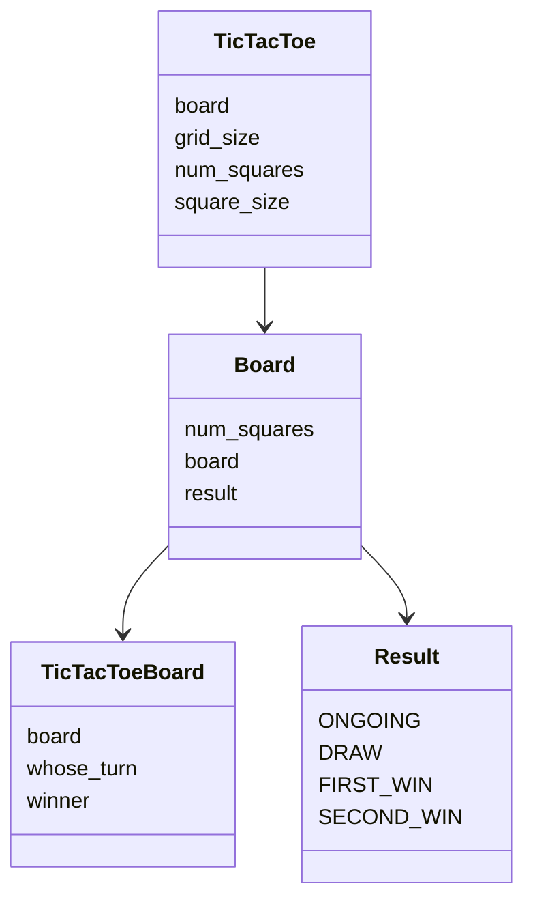
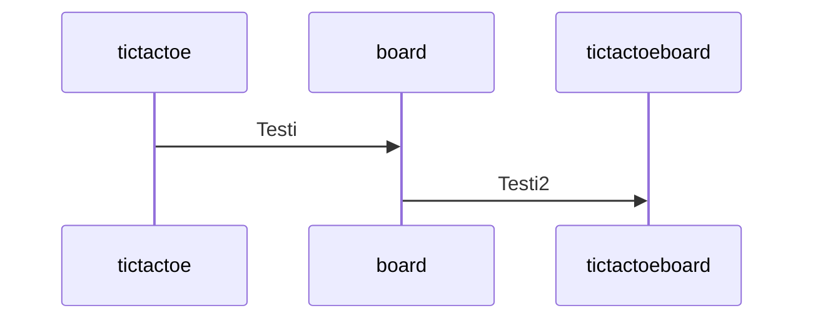

# Arkkitehtuuri

## Käyttöliittymä

Sovellus avaa pygamen avulla ikkunan pelille ja pelin loputtua ilmoittaa voittajan tai tasapelin

## Rakenne

Koostuu main-ohjelmasta ja kolmesta eri luokasta
- Luokka TicTacToe on käyttöliittymä, jossa ohjelma tapahtuu
- Luokka Board on lauta, johon voi mahdollisesti lisätä myöhemmin muita laudalla toimivia pelejä halutessaan
- Luokka TicTacToeBoard on tictactoe lauta, joka omaa kaikki tictactoelle tyypilliset piirteet

#### Sekvenssikaavio luokista ja niiden muuttujista

## Päätoiminnallisuudet

