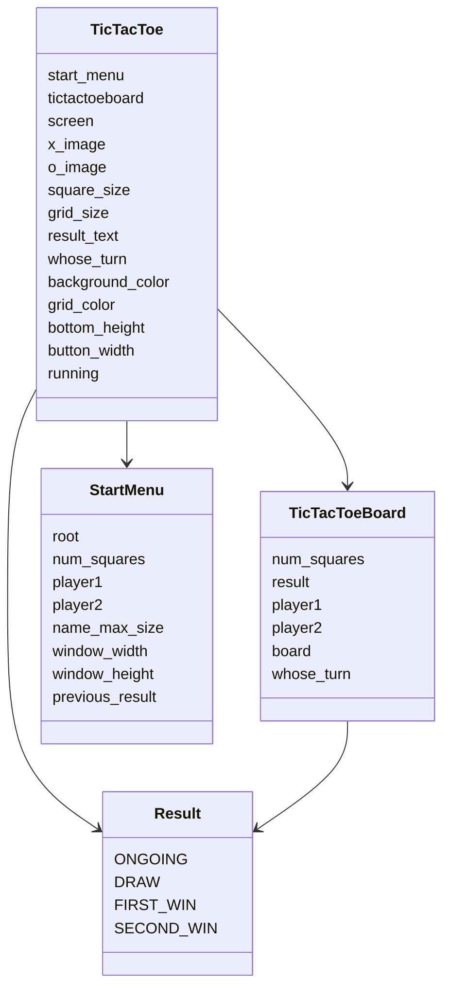

# Arkkitehtuuri

## Käyttöliittymä

Sovelluksen käyttöliittymä on tehty StartMenu ja TicTacToe luokkien ympärillä.

- Pelin aloitusruutu (StartMenu)
- Ristinolla peli (TicTacToe)

TicTacToe luokka (ui) pitää huolen siitä, että aloitusruutu ja pygame ikkuna avautuvat oikeissa kohtaa

Kun peli aloitetaan StartMenu luokasta, TicTacToe luokka tarkistaa, onko arvot oikein. Jos ovat avaa itse pelin, josta taas voi tallentaa ja ladata pelin halutessaan. Kun peli tallennetaan. Se tallentuu .ttt tiedostossa ja tämän myötä vain .ttt päätteiset tiedostot avautuvat ohjelmassa. Ui ilmoittaa onnistuiko tallennus tai lataus Tkinter messagella.

## Rakenne

Koostuu main-ohjelmasta ja neljästä eri luokasta
- Luokka TicTacToe on käyttöliittymä, jossa ohjelma tapahtuu
- Luokka TicTacToeBoard on ristinolla lauta, joka omaa kaikki ristinollalle tyypilliset piirteet
- Luokka Result pitää yllä missä vaiheessa peliä ollaan menossa
- Luokka StartMenu on luokka, missä pidetään yllä aloitusruutua

#### Sekvenssikaavio luokista ja niiden luokkamuuttujista

## Päätoiminnallisuudet

