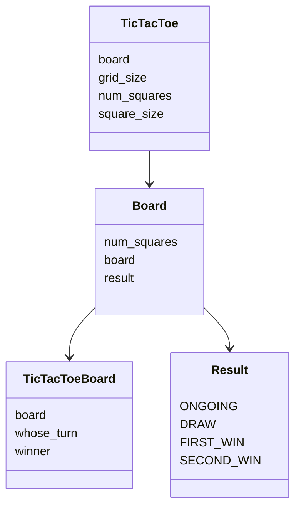
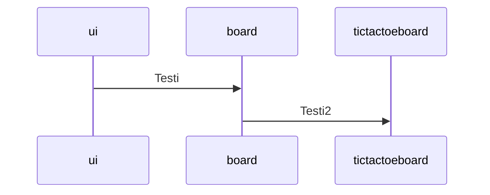

```mermaid
 classDiagram
      TicTacToe --> Board
      Board --> TicTacToeBoard
      Board --> Result
      class TicTacToe{
          board
          grid_size
          num_squares
          square_size
      }
      class Board{
          num_squares
          board
          result
      }
      class TicTacToeBoard{
          board
          whose_turn
          winner
      }
      class Result{
          ONGOING
          DRAW
          FIRST_WIN
          SECOND_WIN
      }
```

```mermaid
sequenceDiagram
  participant ui
  participant board
  participant tictactoeboard
  ui->> board: Testi
  board->>tictactoeboard: Testi2
```
