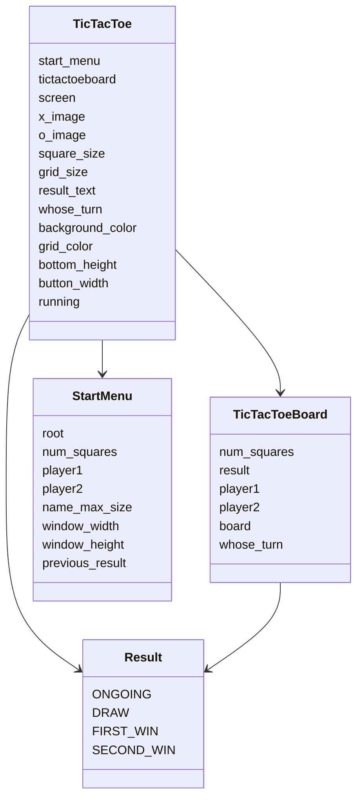
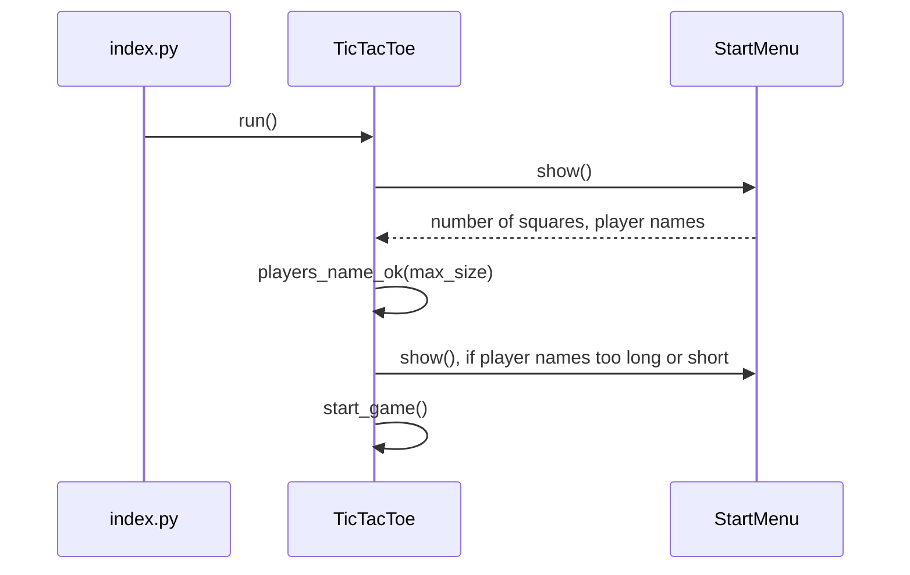
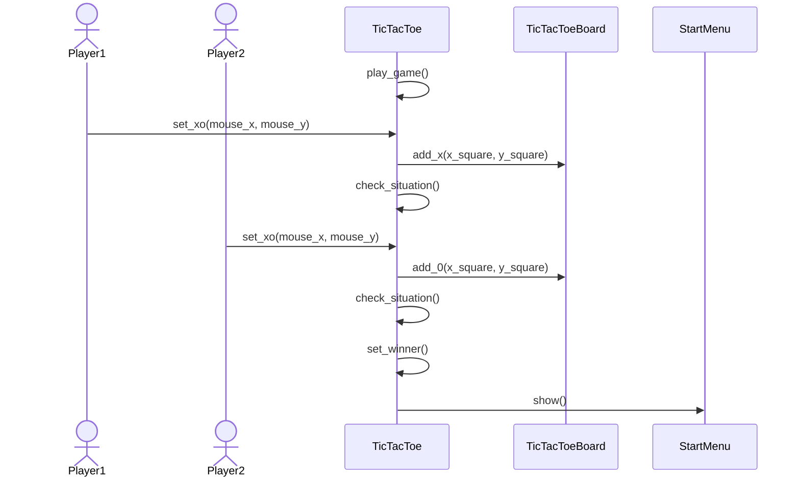

# Arkkitehtuuri

## Käyttöliittymä

Sovelluksen käyttöliittymä on tehty StartMenu ja TicTacToe luokkien ympärillä.

- Pelin aloitusruutu (StartMenu)
- Ristinolla peli (TicTacToe)

TicTacToe luokka pitää huolen siitä, että aloitusruutu ja pygame ikkuna avautuvat oikeissa kohtaa

Kun peli aloitetaan kutsumalla TicTacToe luokan run() metodia se avaa StartMenu luokan avulla ikkunan, johon käyttäjä voi syöttää pelin aloitusarvot: laudan ruutujen määrä ja pelaajien nimet. TicTacToe luokka tarkistaa, ovatko annetut arvot oikein. Jos ovat, käynnistää itse pelin. Pelin aikana käyttäjä voi tallentaa pelin, ladata aikaisemmin tallennetun pelin tai lopettaa pelin. Pelit tallennetaan tiedostoihin, joiden pääte on .ttt (TicTacToe), ja tämän myötä vain .ttt päätteiset tiedostot avautuvat ohjelmassa. Käyttöliittymä ilmoittaa Tkinter luokan avaaman popup ikkunan avulla onnistuiko tallenus7lataus operaatio.

## Rakenne

Ohjelma koostuu main-ohjelmasta ja neljästä eri luokasta
- Luokka TicTacToe on itse pelin käyttöliittymä, jossa käyttäjät voivat pelata ristinolla peliä
- Luokka TicTacToeBoard on tietorakenne, jossa pidetään yllä pelin tilaa
- Luokka Result on apuluokka, jossa on määritelty missä tilanteessa peli voi olla
- Luokka StartMenu on Tkinter kirjaston avulla toteutettu aloitusvalikko, jossa määritellään pelin aloitusparametrit: Laudan ruutujen määrä ja pelaajien nimet

#### Sekvenssikaavio luokista ja niiden luokkamuuttujista

## Tietojen pysyväistallennus

Tallennuksen pystyy tekemään pelin aikana vasemmalta alakulmasta 'Tallenna peli' nappia painamalla. Tämä tarkoittaa käytännössä, että lataat pelin koneellesi .ttt muotoon käyttäen Tkinter kirjaston filedialog.asksaveasfilename() funktiota:

Lataus on toteutettu samoin kuin tallennus, mutta käytetään Tkinter kirjaston fliedialog.askopenfilename() funktiota:\n

Ohjelma antaa ilmoituksen, jos tallennus/lataus onnistui tai epäonnistui:  

Epäonnistuminen on estetty try-except:llä, jotta ohjelma ei kaadu virheeseen, vaan heittää ainoastaan ilmoituksen asiasta.

## Päätoiminnallisuudet

#### Pelin aloittaminen

Peli aloitetaan index.py tiedoston main funktiosta, joka luo uuden TicTacToe luokan ilmentymän ja käynnistää pelin TicTacToe luokan run-funktiolla. Alla olevassa diagrammissa on kuvattu kuinka pelin aloittaminen etenee. 

Pelin käynnistettyä TicTacToe luokka kutsuu StartMenu luokan funktiota show(), joka avaa ruudun laudan ruutujen määrän määrittelylle ja pelaajien nimeämiselle. TicTacToe luokka tarkastaa ovatko arvot oikein. Jos huomataan arvojen virheellisyys, ohjelma palaa aloitusruutuun. Muuten peli alkaa normaalisti ja pygame ikkuna avautuu 

#### Pelin pelaaminen

