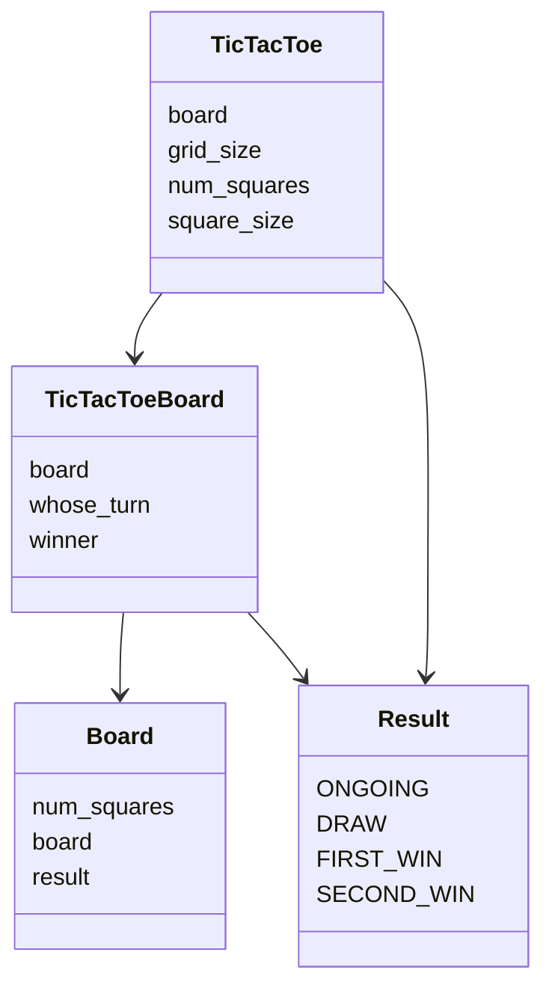

# Arkkitehtuuri

## Käyttöliittymä

Sovellus avaa pygamen avulla ikkunan pelille ja pelin loputtua ilmoittaa voittajan tai tasapelin

## Rakenne

Koostuu main-ohjelmasta ja neljästä eri luokasta
- Luokka TicTacToe on käyttöliittymä, jossa ohjelma tapahtuu
- Luokka Board on lauta, johon voi mahdollisesti lisätä myöhemmin muita laudalla toimivia pelejä halutessaan
- Luokka TicTacToeBoard on Board luokan aliluokka ja on ristinolla peli, joka omaa kaikki ristinollalle tyypilliset piirteet
- Luokka Result pitää yllä missä vaiheessa peliä ollaan menossa

#### Sekvenssikaavio luokista ja niiden luokkamuuttujista

## Päätoiminnallisuudet

