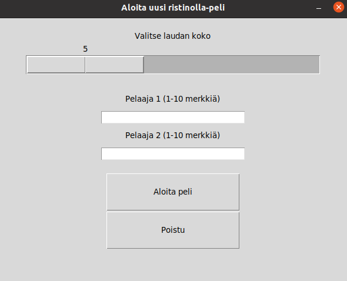
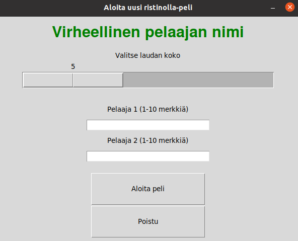
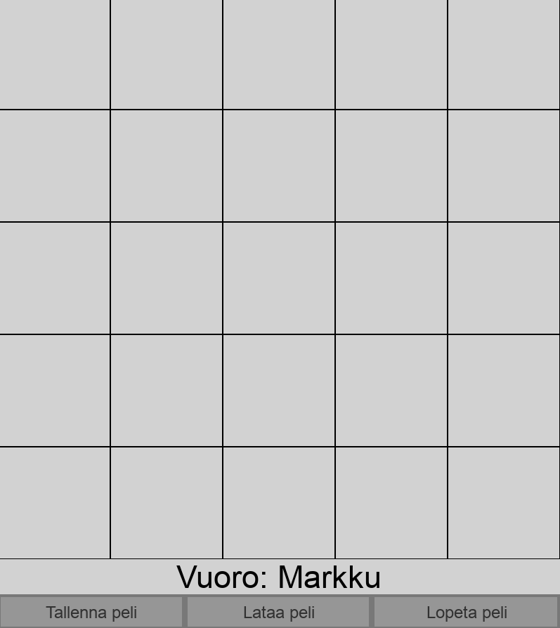
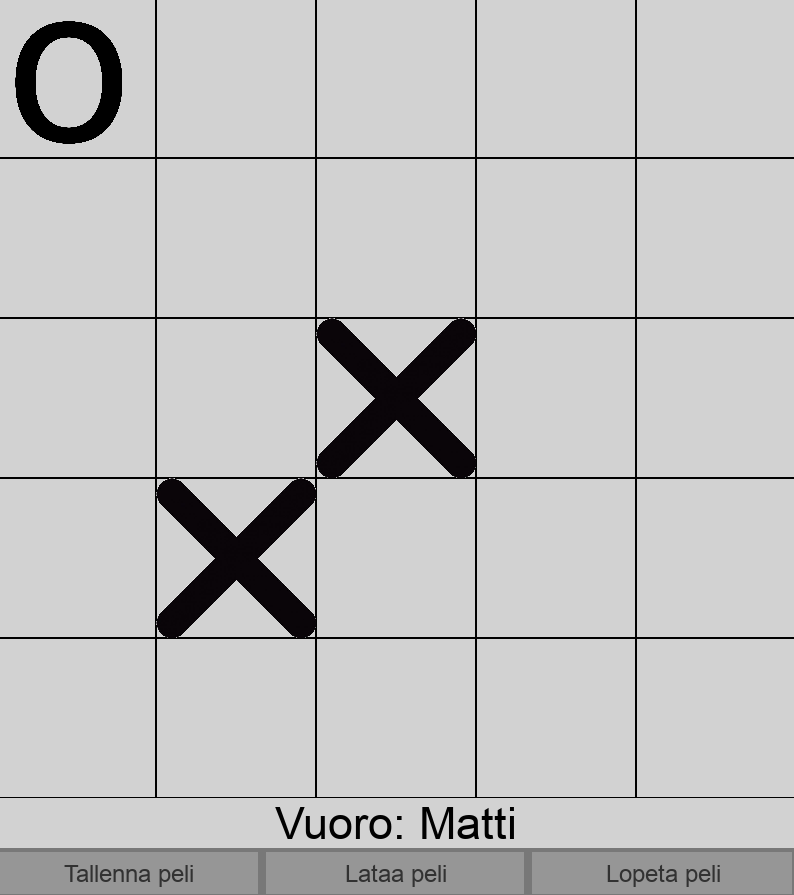
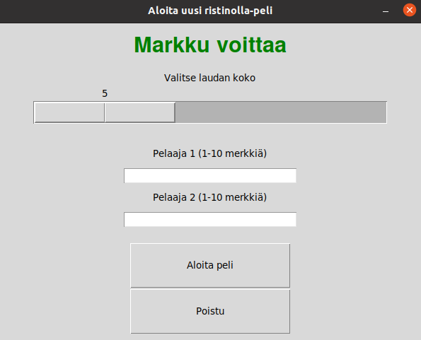
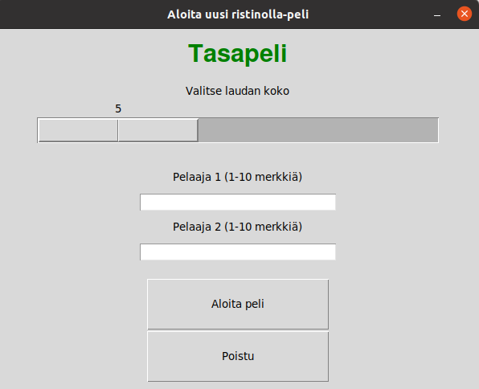

## Käyttöohje

Voit ladata uusimman version [tästä](https://github.com/TatuSorjonen/ot-harjoitustyo/releases/tag/viikko6)

Ohjelma tarvitsee python 3.8 version toimiakseen

#### Tarvittavat komennot komentorivillä

1. poetry install
2. poetry run invoke start
3. Ruudulle käynnistyy ohjelma

#### Ohjelman käynnistettyä

Kun ohjelma käynnistetään syntyy aloitusruutu mistä valitaan laudan koko, pelaajien nimet ja aloitetaanko peli vai lopetetaanko.

Kuvan mukaisesti voit valita laudan kooksi 5-30 ruutua ja vain 1-10 merkkisen nimen pelaajille.

Jos kuitenkin jostain syystä laitat 0 tai yli 10 merkkiä pitkän nimen kummalle tahansa. Ilmoittaa ohjelma tästä seuraavalla tavalla:

Tämän jälkeen voit aloittaa pelin kun sinulla on kaksi pelaajaa nimettynä, painamalla 'Aloita peli' painikkeesta
pelille aukee ikkuna:

Tässä ikkunassa voidaan vuorotellen painella ruutuja (Vuoro vaihtuu automaattisesti), kunnes toinen pelaaja saa neljän suoran tai lauta menee täyteen.

Pelissä voi myös tallentaa, ladata ja sulkea pelin.
Jos painat 'Tallenna peli' nappulasta sinulle ilmestyy ruutu missä voit tallentaa pelin tiedostoon:

Jos taas haluat ladata pelin voit painaa 'Lataa peli' nappulasta ja sinulle ilmestyy ruutu mistä voit valita jonkin .ttt tyyppisen tiedoston

Peli ilmoittaa, jos lataus ei onnistu tai onnistuu (esimerkissä tallennuksen epäonnistuminen):

Jos toinen pelaaja voittaa, peli palautuu aloitusvalikkoon ja ilmoittaa tuloksen:

Myös tasapelistä tekee saman:

Voit aloittaa pelin niin monta kertaa kuin jaksat

Kun et enää jaksa pelata, voit lopettaa pelin painamalla 'Poistu' painiketta tai itse pelissä 'Lopeta peli painiketta'
