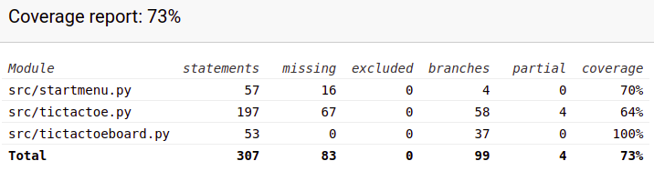

# Testausdokumentti

Ohjelmaa testataan käyttäen unittestia ja manuaalisesti

## Yksikkötestaus

Jokaisesta luokasta on tehty oma testiluokka yksikkötestausta varten. Yksikkötestauksessa pyrin testaamaan kaikkien luokkien funktiot ja niiden paluuarvot, jotka eivät vaadi palautetta käyttäjältä. Kaikkia testejä varten luokasta luotiin olio tietyillä parametreillä, jonka jälkeen olioiden funktioita voitiin testata

#### Testauskattavuus

Testauksen haarautumakattavuus on 73% testaamattomat käyttöliittymähaarautumat mukaan lukien. Testiluokat TestTicTacToe, TestStartMenu ja TestTicTacToeBoard sijaitsevat tiedostossa tictactoe_test.py

## Järjestelmätestaus

Sovellusta on testattu manuaalisesti

#### Asennus

Sovellus haettu ja testattu Linux-ympäristössä käyttöohjeen avulla.

#### Toiminnalisuudet

[Vaativuusmäärittelyn](https://github.com/TatuSorjonen/ot-harjoitustyo/blob/main/maarittelydokumentti/vaatimusmaarittely.md) ominaisuudet on käyty läpi.
Olen testannut myös esimerkiksi:
- Jommankumman pelaajan nimi on virheellinen.
- Laudan koko ei ole virheellinen, vaikka ruutujen määrä ei ole jaollinen ikkunan koolla.
- Ristinollassa käyttäjän painettua ruutua, jossa on jo merkki, ohjelma ei laita samaan kohtaan toista merkkiä ja vuoro ei vaihdu.
- Jos painat ruudukon ulkopuolelle ei tapahdu virhettä.
- Latauksessa ja tallennuksessa ei tapahdu virhettä vaikka syöttää väärän tiedoston muodon tai väärän tiedoston sisällön. Ohjelma näyttää kiltisti onnistuiko vai eikö.
